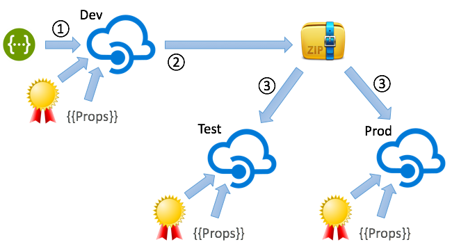
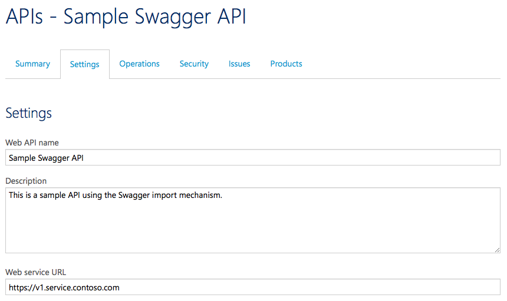

# Azure APIm Deployment Utils

## Introduction

In order to automate deployment to and from Azure API Management instances, we needed some kind of tooling to accomplish this. In many cases, the Azure Powershell Cmdlets will help you doing things, but in some cases, they just don't go far enough, and/or you want to deploy from a Linux/Mac OS X build agent/client.

We wanted to be able to accomplish the following things:

* Extract configuration from an API Management instance as far as possible, using the REST API and/or git Repository integration
* Push configurations to other APIm instances, using both the REST API and the git repository.
* Get simpler access to the APIm management and admin interfaces
  * Retrieving access tokens programmatically
  * Opening the Admin UI automatically (without going to the Azure Portal)

The python scripts at hand can do these things, mostly using the git integration, and the rest using the REST API (no pun intended).

**Discaimer**: The scripts were developed on Mac OS X, and will most likely work on Linux and Windows, too, but have not (yet) been tested to do so.

#### Documentation Contents

The documentation consists of two parts (and a planned one): 

* A short tutorial on how to get started
* A more thorough documentation on how it works behind the scenes
* **Later**: Source code documentation

# Getting started

In order to get started with the scripts, please first make sure you meet the [prerequisites](#prereqs). You can either [run the scripts using `docker`](#docker), or run them directly using your local Python interpreter. Using the docker image ensures that it will always work, disregarding of your operating system, so for running the scripts, docker is the recommended way.

## Preparing your configuration files


<a name="docker"></a>
## Run using `docker`

WIP.

<a name="python"></a>
## Run locally using Python


# Behind the scenes

### How does this work?

This is the principal idea how the scripts are intended to work:



In this picture you see three (point being: two or more) different instances of API Management which reflect the different stages of development of your API Management solution. In the documentation I will assume you have a three stage landscape (Dev, Test/Stage and Prod), but it is not limited to that. It does though only make sense to use the scripts if you are using more than one instance of Azure API Management instances, like this:

* **Dev** - a "Developer" instance of Azure API Management
* **Test/Stage** - may also be a "Developer" instance
* **Prod** - usually at least a "Standard" instance of API Management, even though the scripts will work with any type of instance.

An Azure API Management instance configuration consists of a lot of information, of which most is retrievable using the [`git` integration](https://azure.microsoft.com/en-us/updates/manage-your-api-management-service-instances-by-using-git/), but not all information is contained in the repository. Namely the following things are not included:

* Client Certificates for use for Mutual SSL connections to the backend
* Properties for parametrizing policy definitions

This means any deployment script needs to take care of these things in addition to just pushing the git configuration to a different instance. Fortunately, there is a REST API of Azure API Management which lets you do that, and this is also addressed by the scripts.

Additionally, all CRM content is (unfortunately) not contained in the git repository, but that part is **not** covered by the scripts (as the content is not available "from the outside").

#### From where do you typically use these scripts? (Use Cases)

##### Build environments

These deployment utility scripts are typically used within Build definitions, using some kind of build management tool. The only requirement on such a tool is that they must be able to trigger python scripts. Typical build tools are:

* [Team Foundation Build Service](https://msdn.microsoft.com/en-us/library/vs/alm/build/feature-overview)
* [ThoughtWorks go.cd](https://www.go.cd/)
* [Jenkins](https://jenkins-ci.org/)

The scripts being implemented in more or less plain vanilla Pyton 2.7.x enables you to choose any tool which allows you to run Python scripts.

**Remarks**:

* We at Haufe are using go.cd for automating builds. More information on this integration may follow in the future.
* This repository does (currently) **not** contain anything specific to a special build environment
* All parameters are assumed to be stored as environment variables, which is something all build environments tend to support quite easily out of the box. 

##### From the command line (developer tooling)

In some cases, the script may be useful simply for interacting with the Azure APIm instances, e.g. for [calling the Admin UI](#admin_ui) without havng to go via the Azure Portal, or doing manual extracts and deployments via the command line interface.

These use cases and/this functionality is described in the [utilities](#utilities) section.

##### As a base for other custom Python scripts

Using the [apim_core](#apim_core) module, you can also create other functionality based on the `AzureApim` class; it helps you create SAS tokens and such which are always needed when communicating with the REST API.

Also feel free to fork the repository and create pull requests in case you feel there is functionality which should be added.

#### What's in this package?

To get the expectations straight for these scripts: The scripts are intended to enable you to do **automatic deployments** to and from Azure API Management instances, but they can only provide a means for you to do this. Depending on your deployment scenarios, you will need different lego bricks to build up your pipelines.

In the following sections I will describe the deployment pipeline we have chosen you use, but your mileage may vary largely.

In case you have use cases you think are missing/the scripts do not reflect this, please open an issue so that we can discuss possible solutions.

#### Development principles

In order to get a good development experience when dealing with Azure API Management, you should follow some principles:

* Never hard code URLs, user names, passwords or any other sorts of credentials into your policies.
* Use properties for all these things.
* Design your API policies in such a way that they are instance independent; fight "we only need this for Prod" arguments
* Make use of Swagger imports, do not work with operation definitions, as they would be overwritten by the Swagger import anyway
* Automate as much as possible, definitely the following things:
  * Swagger imports
  * Configuration ZIP extracts

#### Development cycle

The following development cycle will with the Azure API Management in conjunction with these scripts:

1. Configure your "Dev" instance using the following means (not part of the scripts):
  * Manual policy configuration
  * API basic definitions
  * Swagger imports/updates
  * Property definitions
  * ...
2. Optionally (but recommended): Include an automated update of your API definitions via Swagger (covered by the scripts)
3. After each update (="build"), extract the configuration from the Dev instance into a ZIP archive (covered by the scripts)
4. At deployment time to Test (for your backend service), also deploy the API ZIP to your Test/Stage API Management instance (covered by the scripts)
5. When tests successfully finished, and right after you have deployed your backend services to Prod, use the very same ZIP file to deploy the configuration to your Prod APIm instance (with the scripts)

The difference between the deployments to the different APIm instances should ideally only lie within the configurable bits, i.e. in [certificates](#certificates) and [properties](#properties).  

### Consequences of automation

When deciding to automate the deployment of API definitions to Azure API Management, this will have some effects on how you need to design/implement policies. The following section describe some typical problems you encounter and the workarounds and/or patterns you can apply to achieve what you need.

<a name="service_url"></a>
#### Making the service URL configurable

A major pain point with the API definitions in Azure API Management is that it is not - out of the box - possible to parametrize the `serviceUrl` of an API (also known as the service backend URL). One would expect it to be possible to use a property to supply the URL, but unfortunately, this is not possible (using ``{{MyApiBackendUrl}}` is rejected for not being a proper URL).

The workaround for this is to use the `<set-backend-service>` policy on an API level, and there make use of a property.

**Example**:
```xml
<policies>
	<inbound>
		<base />
		<set-backend-service base-url="{{MyApiBackendUrl}}" />
	</inbound>
	<backend>
		<base />
	</backend>
	<outbound>
		<base />
	</outbound>
	<on-error>
		<base />
	</on-error>
</policies>
```

**Remember**: No hard coded URLs, user names and/or passwords inside your `git` repository, otherwise you'll be unhappy. All moving parts in certificates and properties only!

#### Automated updates of API definitions via Swagger

In order to update an API via its Swagger definition using the REST API (as opposed to the Web UI), it is necessary to know the *aid* (API ID) of the API to update. Finding this id is either a matter of pattern matching, or you need to define a unique ID which is both present in the APIm instance and on your own side.

To solve this problem, the scripts at hand chose to "abuse" the `serviceUrl` (see also above) to map the API to a Swagger definition. See section on the [`swaggerfiles.json`](#swaggerfiles) configuration file properties. This issue is described in more depth there.

<a name="prereqs"></a>
## Prerequisites

#### Running using `docker`

In order to run the scripts using `docker`, you will only need the following:

* A working `docker` host installation (1.10.3+),
* A `docker` command line interface, such as the "Docker Toolbox" for Windows or Mac OS X, or an actual Linux docker host.

#### Running using a local Python installation

In order to run the scripts, you will need the following prerequisites installed on your system:

* Python 2.7.x
* PIP
* The Python `requests` library: [Installation Guide](http://docs.python-requests.org/en/master/user/install/)
* The Python `gitpython` library: [Installation Guide](http://gitpython.readthedocs.org/en/stable/intro.html)
* `git` (available from the command line)


# Usage

Depending on the script you are using, the deployment scripts expect information from files residing in the same directory (referred to as the *configuration directory*). 

<a name="config_file"></a>
## Configuration directory structure

You can find a sample configuration repository inside the `sample-repo` directory. The following files are considered when dealing with an Azure API Management configuration:

* [`instances.json`](#instances): A file containing the `id`, `primaryKey` and other information on the Azure APIm instance to work with. It makes sense to get this information from environment variables, e.g. for use with build environments (which can pass information via environment variables).
* [`certificates.json`](#certificates): This file contains the certificates meta information which gives information on which certificates for use as client certificates when calling backend service are to be used. These certificates are subsequently to be used in authentication policies. See the sample file for a description of the file format.
* [`properties.json`](#properties): Properties to update in the target APIm instances. See the file for the syntax. Properties can be used in most policy definitions to get a parametrized behaviour. Typical properties may be e.g. backend URLs (used in `set-backend-service` policies), user names or passwords.
* [`swaggerfiles.json`](#swaggerfiles): Used when updating APIs via swagger files which are generated and/or supplied from a backend service deployment.
* [`docker_env.list`](#docker_env): A list of all [environment variables](#env_variables) used in all of the configuration files. This is used when passing environment variables from the `docker` host to the container.

<a name="env_variables"></a>
##### Using environment variables

In all configuration files, it is possible and advisable to make use of environment variables to inject information in the configuration files. Inside both properties (keys) and values, all strings starting with a dollar sign `$` are considered being environment variables. The environment variable reference is thus replaced with the content of the variable.

This is an important concept when using the scripts inside build environments: This is how you introduce differences between instances (Dev, Test, ..., Prod). In build environments, it is normally possible to define a set of environment variables "from the outside", and via this mechanism use the very same ZIP file for deployment into multiple instances (which is the purpose of the ZIP file). 

<a name="instances"></a>
### Config file `instances.json`

A sample file can be found in the sample repository: [`instances.json`](sample-repo/instances.json).

```json
{
    "apim": {
        "id": "$APIM_ID",
        "key": "$APIM_PRIMARY_KEY",
        "url": "$APIM_MGMT_URL",
        "scm": "$APIM_SCM_HOST",
        "host": "$APIM_GATEWAY_HOST"
    }
}
```

Inside the `instances.json` file you describe the Azure APIm instance you want to interact with using the scripts. These values can be found in the Azure APIm Admin UI, under "Security", and "API Management REST API". The check box "Enable API Management REST API" must be checked, which in turn shows the `id` ("Identifier") and an access key ("Primary Key" or "Secondary Key", both work), which has to be put in as `key`.

The property `url` has to provide the Management API URL, which is also stated on that page, under "Management API URL". If your APIm instance is called `myapim`, this will be `https://myapim.management.azure-api.net`.

As for the property `scm`, this has to point to the `git` repository of your API Management instance. If your APIm instance is called `myapim`, this will be `https://myapim.scm.azure-api.net`.

The last property, `host`, needs to point to the host name of your APIm Gateway (**not** the portal, the **Gateway**). If you have not customized this, this will be (using the same sample name as above) `https://myapim.azure-api.net`. If you have provided a custom domain for your API Gateway, supply the custom DNS entry here (as configured in the Azure Portal).

Note the use of [environment variables](#env_variables), which is not mandatory, but advisable.

The `instances.json` file is **mandatory**; without it, the scripts will not be able to resolve the target APIm instance.

<a name="certificates"></a>
### Config file `certificates.json`

A sample file can be found in the sample repository: [`certificates.json`](sample-repo/certificates.json).

```json
{
    "certificates": [
        {
            "fileName": "$APIM_CLIENT_CERT_PFX",
            "password": "$APIM_CLIENT_CERT_PASSWORD"
        }
    ]
}
```

In this file, you can provide client certificates which are to be used for communicating with your backend services (mutual SSL). You may provide a list of JSON objects, each containing a (preferably fully qualified) filename (`fileName`) pointing to a PFX file, and the corresponding password (`password`).

This file is used in conjunction with the [`apim_update`](#apim_update) and [`apim_deploy`](#apim_deploy) scripts.

The scripts will compare the SHA1 fingerprints of the certificates present in the target APIm instance with what's inside the `certificates.json` file. If new certificates are detected, they will be inserted. If "unknown" certificates are found in the APIm instance, these certificates will be delete. The mechanism relies on the SHA1 fingerprint of the certificates to be unique.

When using this mechanism in conjunction with `apim_update` and/or `apim_deploy`, you will want to retrieve the PFX files and the corresponding passwords from a secure storage and pass in the location to the file via [environment variables](#env_variables), as is suggested in the sample above, too. **Note**: The secure storage/credential vault is **not** part of this script distribution.

The `certificates.json` file is **optional**. Without it, `apim_update` will not alter your certificate settings. Having an *empty* file will delete any certificates in your instance.

<a name="properties"></a>
### Config file `properties.json`

A sample file can be found in the sample repository: [`properties.json`](sample-repo/properties.json).

```json
{
    "BackendServiceUrl1": {
        "secret": false, 
        "value": "$APIM_BACKEND_1", 
        "tags": [
            "sometag"
        ]
    }, 
    "BackendServiceUrl2": {
        "secret": false, 
        "value": "$APIM_BACKEND_2", 
        "tags": []
    },
    "BackendClientCert": {
        "secret": true,
        "value": "$APIM_CERT_THUMBPRINT",
        "tags": [
            "certificate"
        ]
    }
}
```

The `properties.json` file contains a dictionary of properties, which each contain the following sub properties:

* `secret`: Is the property containing a secret/credential? If so, this means that it will not be displayed in the Admin UI. Defaults to `false`
* `value`: The value of the property; usually, this will be retrieved from an [environment variable](#env_variables) (see there for a discussion on usage); it may also be clear text.
* `tags`: Contains a (possibly empty) list of tags to associate with the property; this is only used for display purposes in the Azure APIm Admin UI and has no further impact on functionality.

The intended use of properties are for example the following:

* Setting behavioral switches, such as enabling or disabling logging
* Providing credentials to logging facilities, such as Azure Event Hubs
* Setting backend service URLs (albeit using the [`set-backend-url`](#service_url) policy)
* Other properties controlling instance specific things (please let me know if you have other use cases, I will add them here)

The `properties.json` file is **optional**. Without it, `apim_update` will not alter your properties settings. Having an *empty* file will delete any properties previously present in your instance.

<a name="swaggerfiles"></a>
### Config file `swaggerfiles.json`

A sample file can be found in the sample repository: [`swaggerfiles.json`](sample-repo/swaggerfiles.json).

```json
{
    "swaggerFiles":
    [
        {
            "serviceUrl": "https://v1.api1.domain.contoso.com",
            "swagger": "$APIM_SWAGGER_API1"
        },
        {
            "serviceUrl": "https://v1.api2.domain.contoso.com",
            "swagger": "$APIM_SWAGGER_API2" 
        }
    ]
}
```

The `swaggerfiles.json` is used by the `apim_update` script to update a list of APIs using their Swagger definitions.

This functionality is intended to be used after you have deployed your backend service to your Dev instances; the deployment scripts of your backend service (which in turn should supply the Swagger files) should trigger the `apim_update` script, which updates the API in your Dev APIm instance using the Swagger files.

Due to the fact that Azure APIm does not let us specify the service URL (`serviceUrl`) of an API using properties, which in turn could be used to uniquely identify an API, using these scripts require us to workaround this a little:

* In order to make the backend service URL configurable, you must use the [`<set-backend-url>` policy](#service_url)
* **Instead, we are using the `serviceUrl`, or "Web Service URL" (in the Admin UI) as an identifier of the API**

**Example**: APIs should be configured in such a way that the "Web Service URL" contains a URI-type identifier which - on a meta level - describes the service which lies behind the API:



A naming schema for this may for example be: `https://<version>.<service name>.<yourcompany>.<tld>`, such as here `https://v1.service.contoso.com`. This is obviously a **fictional** URL which does not actually lead to the backend service. The backend URL is instead stored in a [suitable property](#properties) and used in a [`<set-backend-url>` policy](#service_url)

This is an ugly workaround for not being able to use a property in the `serviceUrl`. As soon as this limitation is lifted in Azure APIm, the `<set-backend-url>` policies can be removed, when using a property for the "Web Service URL".

The `swaggerfiles.json` file is **optional**; without it, `apim_update` will not update an APIs. Please note that the *absence* of this file or an entry into the file will **not** result in APIs being deleted from the updated instance. If you need to delete an API, you will have to do that either using the REST API directly and/or using PowerShell Cmdlets, or directly from the Admin UI.

##### Swagger import - Known problems

This section of the script implementation has the following known problems (as of March 16th 2016):

* **Do not use response or body schemas in your Swagger files**: If you use schema definitions using the `$ref` notation inside your Swagger files, these kinds of Swagger files will indeed *import* without error messages, but will not be able to *extract* and *deploy*  such APIs to other instances. This has the following background: The Swagger schema definitions are imported into your APIm instances and are also referenced in the API configuration files you can retrieve via git. But: The schema definitions themselves are **not** part of the git repository. This has the result that the `git` deployment fails due to missing schema definition references. The workaround for now is: Don't use schemas. **The APIm team knows of this and are currently working on a solution.**
* All other Swagger restriction described in the Azure APIm documentation

<a name="docker_env"></a>
### Config file `docker_env.list`

This file is only important when using the `docker` image to run the scripts. When dealing with build environments which use docker images to build things, the build agent itself (=the docker host) will get passed environment variables. These environment variables are (by docker default) **not** propagated to the containers actually running the scripts.

By using the `--env-file=<env var list>` command line switch of the `docker run` command, you can pass on a list of environment variables into the container; by simply stating the names of the environment variables in a list file, `docker run` will automatically pass through the value of the environment variable to the container.

Example file content:
```
# The list of environment variables for use in the container

# For instances.json
APIM_ID
APIM_PRIMARY_KEY
APIM_MGMT_URL
APIM_SCM_HOST
APIM_GATEWAY_HOST

# For certificates.json
APIM_CLIENT_CERT_PFX
APIM_CLIENT_CERT_PASSWORD

# For properties.json
APIM_CERT_THUMBPRINT
APIM_BACKEND_1
APIM_BACKEND_2

# For swaggerfiles.json
APIM_SWAGGER_API1
APIM_SWAGGER_API1
```

A sample file can be found in the [sample config repository](sample-repo/docker_env.list).

# Supported APIm operations

The following sections describe the operations which are supported out of the box by the scripts, in easily useful ways. For further support, it is quite simple to extend the scripts and/or add more scripts to support more things. Most other things which are not covered here are though already available using the PowerShell Cmdlets (link needed).

## Updating an APIm instance

Using Python directly:
```
$ python apim_update.py <config dir>
```

Using `docker`:
```
$ docker run -it -v <config dir>:/apim --env-file=<env list file> donmartin76/azure-apim-deployment-utils update
```

The parameter `<config dir>` must point to directory containing configuration files as described in the [above sections](#config_file).

The `apim_update` script updates a (developer) instance of Azure API Management. The script will perform the following steps (in the given order):

1. Properties are updated according to the [`properties.json`](#properties) configuration file.
1. Certificates are updated according to the [`certificates.json`](#certificates) configuration file.
1. API definitions are updated according to the [`swaggerfiles.json`](#swaggerfiles) configuration file.

Please note that this scripts uses only the REST API of the APIm instance to perform these updates.

##### Intended use of `apim_update`

The script `apim_update` is intended for use after a backend service has been deployed and after it has possibly updated its Swagger definition file. The deployment step of the backend service should automatically trigger an update of the APIm instance via this script. This should be done **automatically**, otherwise you may be at risk of forgetting to update the API definition.

It is advisable to subsequently do an [`apim_extract`](#apim_extract) to encapsulate the state of your APIm instance after the update. This ensures you can push this configuration to other (downstream) APIm instances, like Test, or Prod.

**Note**: The scripts assume you know what you are doing in terms of compatible changes of your API (evolvability, version compatibility). For guidelines on how to accomplish this, please refer to API Styleguides, for example the [Haufe-Lexware API Styleguide](http://dev.haufe-lexware.com/resources/).

<a name="apim_extract"></a>
## Extracting a configuration ZIP file

Using Python directly:
```
$ python apim_extract.py <config dir> <target zip file>
```

Using `docker`:
```
$ docker run -it -v <config dir>:/apim --env-file=<env list file> donmartin76/azure-apim-deployment-utils extract [target zip file]
```

## Deploying a configuration ZIP file (to a different APIm instance)

```
$ python apim_deploy.py <source config zip>
```

(Works, needs to be described)

Things which are confusing:

* The entire configuration is taken from the ZIP file, also the `instances.json`; normally you would parametrize this using environment variables, and via that be able to deploy to a different instance.

##### Special case deleted 'loggers'

... can't be removed in the same step as they are removed from the policies. Two-step deployment (call it a bug of APIm if you want).

##### Special case deleted properties

... can't be removed in the same step as they are removed from the policies. Two-step deployment needed.

<a name="utilities"></a>
## Utility functions

### Extracting Properties

```
$ python apim_extract_properties.py <config dir>
```

Creates `properties_extracted.json` into the *config dir*. Use this file to create your configuration file if you want.

<a name="admin_ui"></a>
### Opening Admin UI (without Azure Portal)

```
$ python apim_open_apim_ui.py <config dir> [<instance>]
```

Opens a web browser pointing to the Admin Portal of your Azure API Management instance, without going via the Azure Classic Portal. Useful.

### Generate PFX/PKCS#12 Thumbprint from file

```
$ python apim_openssl.py <certificate.pfx> <password>
```

Outputs the PFX thumbprint of a certificate file; useful when scripting things. Use this in order to set environment variables which in turn can be used inside properties, e.g. when specifying which certificate should be used for mutual authentication scenarios.


# Appendix

## Further Reading

Links to the Azure APIm documentation:

* ...
